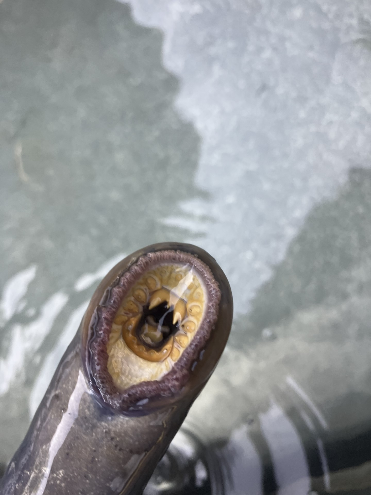

# Chapter 1 Pacific Lamrpey (*Entrosphenus tridentatus*)

Pacfic Lamprey, *Entrosphenus tridentatus*, are indigenous to the Pacific Northwest and can be found in the Columbia River and the Columbia River's tributaries. Pacific Lamprey are a boneless fish that have no fins besides a caudel fin and dorsal fins. Pacific Lamprey are culturally important to the indigenous tribes around the Columbia River. Pacific Lamprey's populations have been effected by the dam construction on the Columbia River. Fish ladders at dams are not lamprey friendly because of the sharp corners, and the flows through the ladder give lamprey difficulty because of the type of swimming motility lamprey have. The indigenous tribes have been the main advocate for Pacific Lamprey monitoring in the Columbia River Basin. The Confederated Tribes of Warm Springs adopted a method from the Nez Perce Tribes by translocating lamprey back onto the Warm Springs Reservation. The collections sites being Bonneville Dam, Columbia River, and Shearers Falls, Deschutes River.

{width="660"}

## 1.1 Institution

This research is being conducted at the University of Idaho to complete Aldwin Keo's requirement for Master's and Phd. Thesis.

## 1.2 Study Site

The study site is the Warm Springs River on the Warm Springs Reservation.

.png)

Figure 1. Map of the Warm Springs Reservation and Warm Springs River.

.png)

Figure 2. map of Oregon and Warm Springs Reservation
