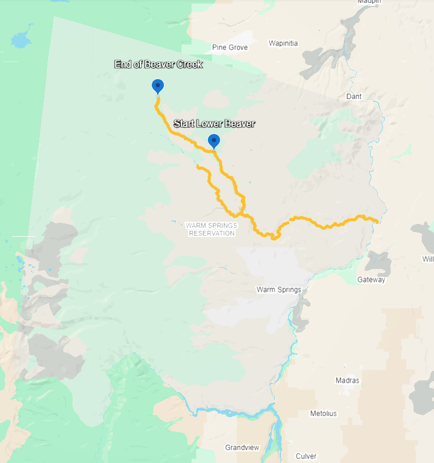

# Pacific Lamprey

Pacific Lamprey, *Entrosphenus tridentatus*, are culturally important to tribes around the Columbia River and tribes around the tributaries to the Columbia River, and it is well known that dams are contributing to the decline in both returning adult lamprey and migrating juvenile lamprey (Close et al 2002). Tribes around the Columbia River and the Columbia River Tributaries rely on lamprey for harvest, and a significant species to the food web because of the nutritional value they bring from the ocean into freshwaters (Close et al 2002). Lamprey has given us an idea of what anthropogenic structures are doing to the ecological environment (Close et al 2002.). The Confederated Tribes of Warm Springs lamprey program started to translocate lamprey from Bonneville Dam, Columbia River, and Sherears Falls, Deschutes River.

## Institution

This research is being done at the University of Idaho to fulfill Aldwin Keo's requirements for his Master's and Doctoral Thesis.

## Study Site

The Study Site is the Warm Spring River on the Warm Springs Reservation and the two collection sites were Sherears Falls and Bonneville Dam

Figure 1. shows the Warm Springs River and Beaver Creek. The two streams are where translocated lamprey from both Bonneville Dam and Sherears Falls were released.
